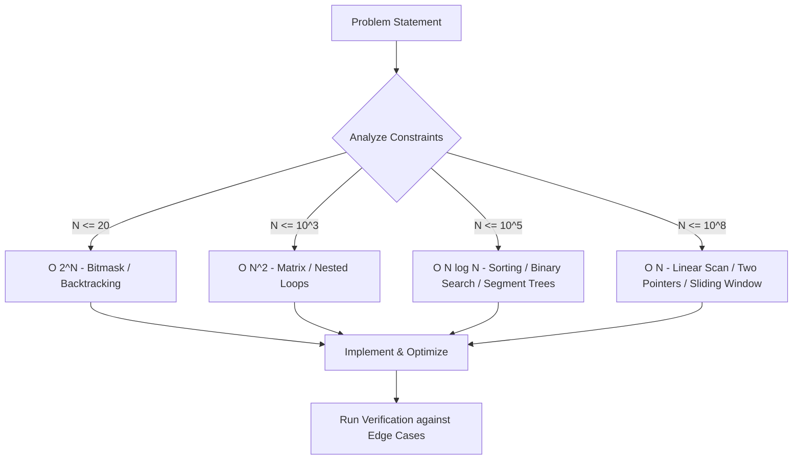

# 🚀 Codeforces Solutions Repository

A structured, clean, and optimized collection of competitive programming solutions for Codeforces problems. This repository serves as a personal archive and a reference guide for algorithmic patterns, data structures, and mathematical insights.


---

## 📌 Features

* **Time & Space Optimized**: Solutions engineered to run well within execution limits.
* **Structured Layout**: Organized systematically by Division, Level, or Difficulty.
* **Algorithmic Insights**: Complex solutions include comments breaking down the core logic.

---

## 🗺️ Algorithmic Workflow & Complexity Maps

The following conceptual diagrams map out the standard decision-making processes and state optimizations applied throughout these solutions.

### 1. Constraint-to-Complexity Decision Tree
This blueprint details how problem constraints dictate the choice of algorithm to avoid Time Limit Exceeded (TLE) verdicts.



### 2. Dynamic Programming (DP) Optimization Path
A visual breakdown of how recursive relations are refined into memory-efficient iterative blocks.


---


## 🛠️ Environment & Compilers

* **Primary Languages:** C++17 / Python 3
* **C++ Compiler:** `g++ -O3 -std=c++17`
* **Template Setup:** Fast I/O optimized blocks included in all source files to decrease execution overhead.

```cpp
// Fast I/O template used across solutions
#include <iostream>
using namespace std;

int main() {
    ios_base::sync_with_stdio(false);
    cin.tie(NULL);
    // Code goes here
    return 0;
}
```

